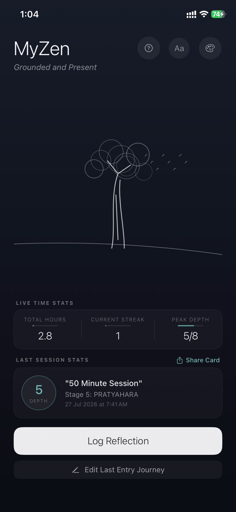
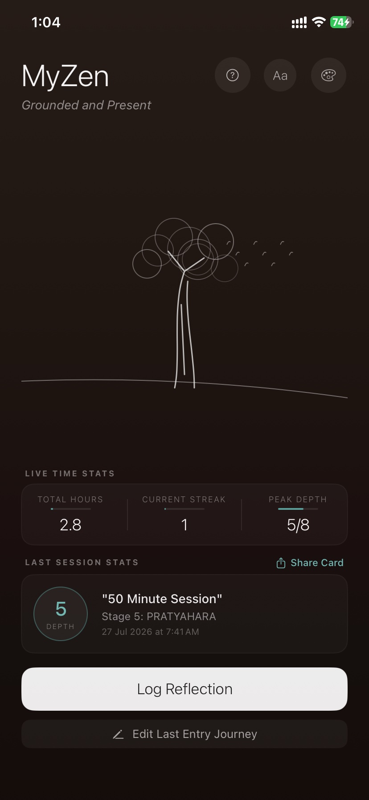
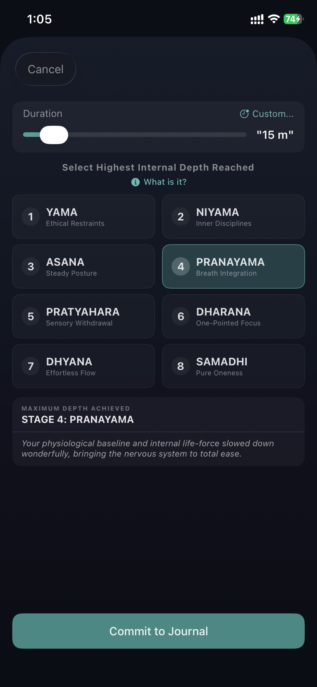
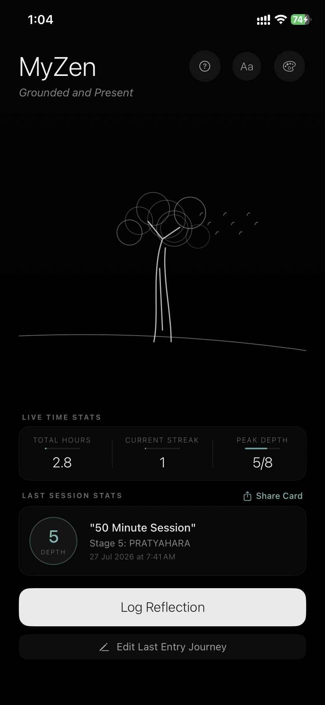
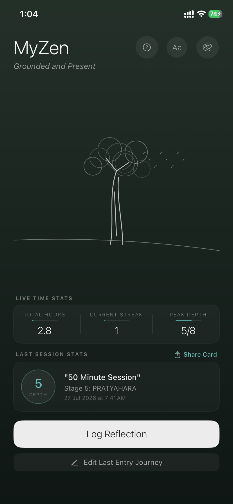
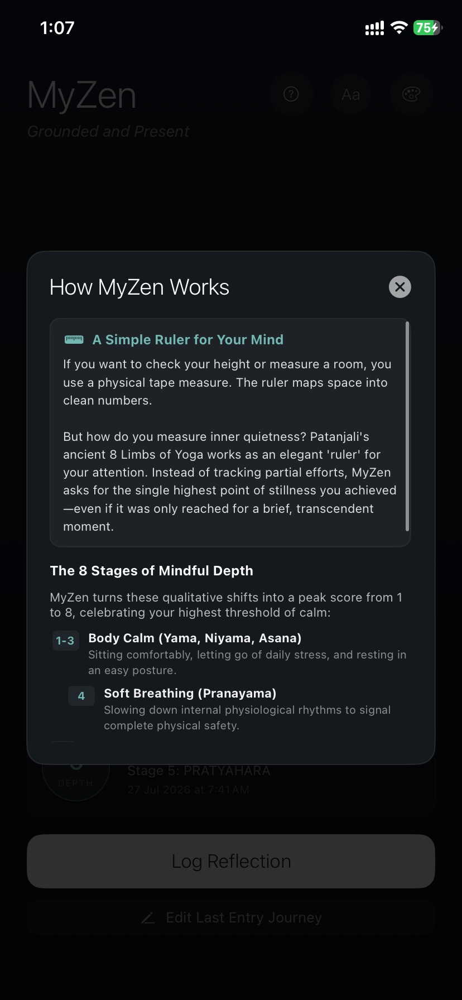
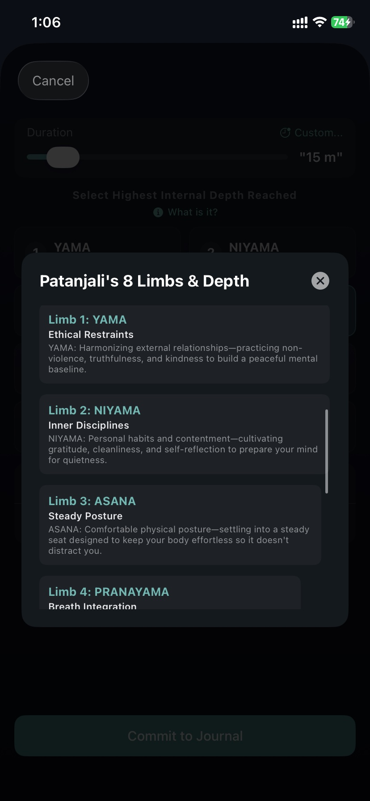
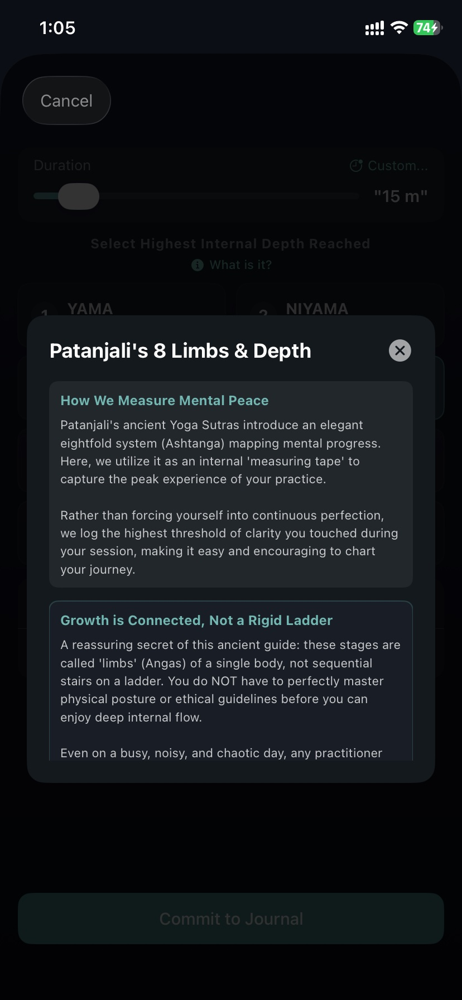
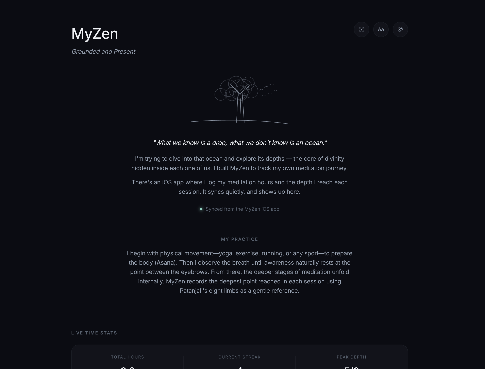
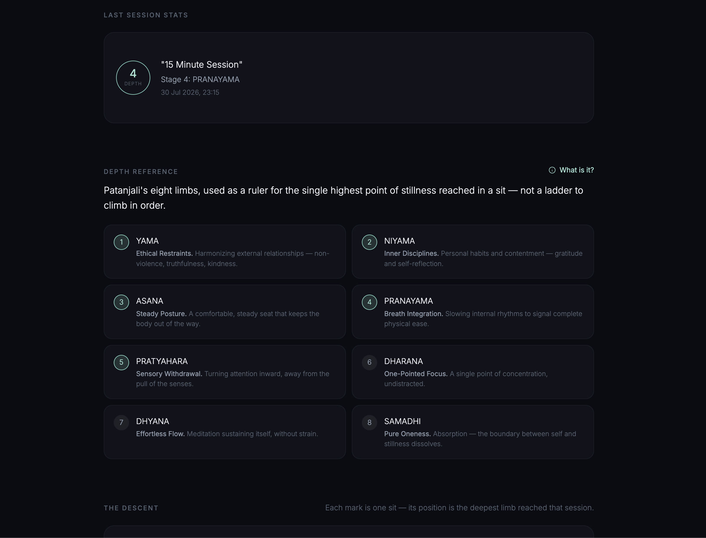

# MyZen

<p align="center">
  <i>Grounded and Present.</i>
</p>

MyZen is a minimalist meditation journal that measures **depth, not just duration**.

Instead of treating meditation as a timer or streak tracker, MyZen records the **deepest state of awareness** reached during each meditation session using **Patanjali's Eight Limbs of Yoga** as an internal reference.

Every session automatically syncs to GitHub, powering a live website that visualizes the journey.

---

## Philosophy

Most meditation apps answer one question:

> **How long did you meditate?**

MyZen asks another:

> **How deeply did you arrive?**

Rather than rewarding streaks or gamifying meditation, MyZen quietly records:

- Meditation duration
- Date & time
- Deepest internal state reached
- Complete meditation history

The accompanying website simply reflects this journal.

---

## My Practice

The meditation technique I currently follow is intentionally simple.

- Begin with physical movement—yoga, exercise, running, or any sport—to prepare the body (**Asana**).
- Sit comfortably and observe the breath.
- As awareness naturally settles, the sensation of breathing is felt at the point between the eyebrows.
- Attention then simply remains there while the deeper stages of meditation unfold internally.

Patanjali's Eight Limbs are used only as a gentle language for describing the deepest point touched during a session—not as a rigid ladder to climb.

---

# Features

## iOS App

- Minimal distraction-free interface
- Log meditation sessions
- Record the deepest limb reached
- Meditation history
- Current streak
- Total meditation hours
- Peak meditation depth
- Beautiful ambient themes
- Font customization
- Share meditation cards
- GitHub synchronization

---

## Web Dashboard

The website is automatically generated from the meditation journal.

It displays:

- Live meditation statistics
- Current streak
- Total meditation hours
- Latest session
- Peak depth
- Interactive Eight Limbs reference
- Meditation timeline
- Consistency heatmap
- Session history
- Responsive design

---

# Measuring Meditation Depth

Instead of scoring meditation, MyZen uses Patanjali's Eight Limbs as a reference.

| Stage | Limb |
|------:|------|
| 1 | Yama |
| 2 | Niyama |
| 3 | Asana |
| 4 | Pranayama |
| 5 | Pratyahara |
| 6 | Dharana |
| 7 | Dhyana |
| 8 | Samadhi |

These are **not achievements** or levels to unlock.

They simply describe the deepest point of stillness reached during a meditation session.

---

# Screenshots 

## iOS App with 4 available theme options

<p align="center">
  
  
  
</p>

<p align="center">
  
  
  
</p>

<p align="center">
  
  
</p>

---

# Web Dashboard





---

# Tech Stack

### iOS

- SwiftUI
- UserDefaults
- ImageRenderer
- GitHub REST API

### Website

- HTML
- CSS
- Vanilla JavaScript
- SVG
- GitHub Pages

### Sync Pipeline

```text
Meditation Session
        │
        ▼
     sessions.json
        │
        ▼
 GitHub Repository
        │
        ▼
 GitHub Pages Website
```

---

# Repository Structure

```text
MyZen
├── MyZen/
├── docs/
├── screenshots/
│   ├── ios/
│   └── webapp/
├── sessions.json
└── README.md
```

---

# Why I Built This

Meditation is deeply personal.

Most apps focus on productivity metrics—minutes, streaks, badges, and achievements.

I wanted something quieter.

A journal that simply reflects practice over time. To motivate me to maintain consistency. 

The Goal of meditation is to finally reach Samadhi, and during the process you keep changing as a person. 
Before reaching that ultimate state, there are intermediate states, which also need constant practice to reach and I want to document my entire journey.

---

> *"What we know is a drop, what we don't know is an ocean."*
